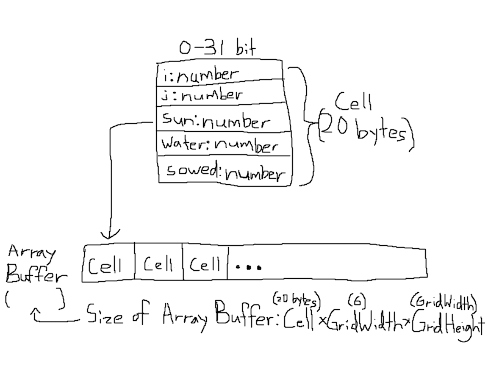

# Devlog Entry - 12/8/2024

## How we satisfied the requirements
## F0 + F1 + F2
No major changes were made.

## F3.a

## F3.b

## Mobile Installation
12/7/2024 - Mobile installation is managed through a Progressive Web App structure that makes use of service workers to store important files needed for execution. The service worker is installed after being registered and pulling the required resources into a newly created cache. The PWA can then make use of this cache to grab resources as opposed to fetching them over the network, allowing for offline play. The creation of a manifest that contained useful information about the app itself was also needed for the app's presentation. Useful resources that helped during the implementation process were as follows: </br>

MDN Documentation: https://developer.mozilla.org/en-US/docs/Web/Progressive_web_apps/Tutorials/js13kGames/App_structure</br>
Developer PWA Tutorial: https://developers.google.com/codelabs/pwa-training/pwa03--going-offline#0

## Mobile Play
12/8/2024 - 

# Devlog Entry - 12/4/2024

## How we satisfied the requirements
## F0 and F1
No major changes were made.

## F2.a
12/1/2024 - Scenarios can now be loaded at compile time through an external DSL. This DSL is based off of YAML and allows designers to specify some initial conditions for each scenario and the conditions needed to complete them. The DSL can also describe special events that happen at specific times within the game. For instance, the following snippet describes the "drought" scenario: </br>
```
drought:
  grid_size: [10, 5]
  available_plants:
    - corn
    - potato
  win_conditions:
    - plants: 20
      time: 30
  special_events:
    - description: "Drought"
      day: 10
      effects:
        - ["water", 0]
        - ["sun", 20]
```
In this example, the grid size is set to ten columns by five rows and the plants available for sowing are potatoes and corn. The conditions for winning the scenario are listed as reaping 20 fully-grown plants within 30 days. Finally, the special event tied to this scenario is a drought event that happens after ten days where all the water on the grid is set to zero and the maximum sun level is set to 20. The design is such that one scenario can possibly have multiple events tied to it.

## F2.b
11/30/2024 - Plants are now modified to use internal plant types in order to classify unique growth rules. These types are compiled from internal definitions written in a domain-specific language within JavaScript. The following code snippet provides the internal definition for an onion plant: </br>
```
function onion($) {
    $.name("onion");
    $.icon("🧅");
    $.grow(({ plant, water, neighbors }) => {
        const sameNeighbors = neighbors
            .filter(neighbor => neighbor.type === plant.type);
        const isHappy = neighbors.length >= 2
            && sameNeighbors.length < 2 && water < 2;
        return isHappy;
    })
}
```
The basic use of this DSL lets you define the name and emoji that a specific plant type uses. The DSL also lets you define the growth conditions for each type given their current context. This context may include the plant itself, the water and sun values for its cell, and a presumed array of its neighboring plants. In this example, the plant will grow if its water is at least two and it has at least two neighbors, but no more than one neighbor of the same type. The expressiveness of the host language gives us more flexibility in defining specific conditions that makes it clear to the writer what those conditions are.

## F2.c
12/4/2024 - As we explained before, our platform switch was to start from TypeScript and to move to ThreeJS. Since TypeScript is a slightly modified version of JavaScript, adjusting our scripting for it wasn't too bad. The biggest redesigning of our code was related to porting our 2D visual gameplay into a 3D space. The 2D farm grid that we previously had is now depicted as a 3D grid with an angled camera overseeing the player space, as well as our player being represented by a 3D cube. Plants are also no longer emojis that grow, but rather modeled and their growth is represented by their stems changing color. UI elements such as gameplay information or buttons are rendered on the screen locally and not within the actual 3D space.

## Reflection
We wouldn't say that our plan has changed too much when it came to completing our F2 requirements.The largest hurdle we faced was reimplementing our game into another game engine and finding the motivation to work on the project with the oncoming holiday break. Having to maintain a balance between these factors along with finals in other classes often caused our team to have communication issues and working effectively towards completing F2 by the initial deadline. In order to compensate for this, we coordinated who would work on what within the project and taking time to catch everyone up to speed about the final's progress. Compared to how bare bones the requirements of the game are, we felt that it would be important to supply the player with more agency as to how they can play the game, along with understanding what they need to do.

# Devlog Entry - 11/27/2024

## Important update regarding project tools
11/24/2024 - Redoing project in Typescript with HTML. Alternate platform is now TypeScript with Three.js. Our intended implementation with Unity proved to be too complex for the move to Godot. Morale has taken a hit but we'll forge onward.

## How we satisfied the requirements
## F0.a
11/24/2024 - Each cell holds information on its relative position within the grid, as well as sun and water levels specific to that cell which are randomized on initialization. 
Functions are provided that enable access to cells based on column and row. 
Player is now a simple object that keeps track of its position in a similar format to the grid cells. 
Player movement is triggered through event listeners on the arrow keys which map to coordinate pairs that are added to the player's position. 
This position is bounded based on the size of the grid itself.

## F0.b
11/25/2024 - Furthermore, time can now be advanced by using the enter key to randomize cells on the grid. This is wrapped in a command that serializes the grid state to allow for undo and redo functionality. The pattern is managed through the same top-level function as player movement.

## F0.c
11/26/2024 - Game now allows players to sow plants on empty cells and reap plants from sowed cells. A click handler on the canvas is used to dispatch reap and sow commands based on the cursor's position and the plant status of the corresponding cell within the grid, which both commands update on execution.

## F0.d
11/24/2024 - As mentioned in F0.a, each grid cell has a sun and water level specific to it. A randomize function is implemented that assigns new values to each level. Sun levels are assigned values within a certain range as before whereas water is randomly incremented or decremented.

## F0.e
11/26/2024 - Plants have two subclasses corresponding to two different kinds of crop. Using the subclass sandbox pattern, these subclasses inherit methods from the base class that check for various growth conditions.

## F0.f
11/26/2024 - The base class also has a grow method that can be overridden to allow for different growing conditions for each distinct crop. To represent their growth, plants keep track of their current stage which gets updated when the right conditions are met.

## F0.g
11/27/2024 - Game now features a win condition, where upon harvesting 20 fully grown crops, a message appears confirming that the player won the game. The win condition also recognizes if the player hits undo, which unchecks the progression towards the win condition and resets the state unless the player has already won the game. This should satisfy the requirements for the specific play scenario for F0.g, and should hopefully be the last of the F0 and F1 requirements that we need to work on for this iteration.

## F1.a
11/24/2024 - Grid is now represented as an ArrayBuffer of cells, which satisfies the AoS format. 


## F1.b 
11/25/2024 - Game now has save functionality that allows players to save and load player position and grid state from localStorage. The Grid now has a serialize function that turns its current state into a string and a deserialize function that allows it to revert to a previously serialized state. </br>
11/26/2024 - Plants are stored in a map with their cell coordinates as the key to allow for simplified access and stringification for save and load functionality. 

## F1.c 
11/26/2024 - Game now has implicit autosave. This is achieved by writing to an "autosave" slot every time the scene is changed. When opening a new session, players are prompted if they want to continue where they left off, loading the most recent autosave if they accept.

## F1.d 
11/24/2024 - Player movement is currently wrapped in a command pattern that allows for separate undo and redo functionality. The command pattern is managed through a top-level function that handles input from the player. </br>
11/25/2024 - Commands are now pushed to command stacks to allow players to undo and redo significant actions. This necessitates that commands store previous state through enclosed data structures. </br>
11/26/2024 - As stated above (F1.c 11/26/2024), reaping and sowing are now wrapped in a command pattern to allow either action to be undone. A command manager is now implemented to allow for separate input handlers to pass commands. </br>

## Reflection

Upon turning in F0, our team was pretty disheartened by the assignment's expectations not being met despite us fulfilling the requirements. 
Considering our previous plan of action was considered unsuitable for the scope of the assignment's progression, we opted to work in TypeScript and to transfer over to Three.JS when the time came.
A lot of our time has been focused towards porting our understanding of the code to TypeScript, and essentially having to do both F0 and F1 from scratch.
We also spent some time setting up our Three.JS environment so that we have a comprehensive understanding of the platform and how we plan to adapt our game to it.
Though we have some regrets not understanding the full scope of the assignment and initially starting in Unity, we are very appreciative of the experience and proud of what we were able to accomplish then.
We haven't really focused on evolving our game design because of the time crunch in reimplementing our code, but it's something that we plan to consider when we port over to Three.JS.

# Devlog Entry - 11/22/2024

## How we satisfied the requirements

## F0.a

F0.a was Implemented using a GridManager class that instantiated a 2D array of Tiles. This corresponds to the Array of Structures format. Player movement is based on discrete units determined by Tile size, while their global position is restricted by the overall size of the grid. Tile-specific data can be accessed through the GetTileAt function. Movement was implemented by checking for keyboard presses binded for movement which are the WASD keys. Pressing a key for the desired direction sends out a target exactly one tile away in the direction the player wishes to move in. If the target returns a valid coordinate within the grid system, the player moves smoothly to the target tile.

## F0.b

F0.b was Implemented using a separate TimeManager class that increments a day counter and adds a basic UI button for manually advancing time. The observer pattern is used to allow other components in the game to subscribe to and listen for the "OnNextDay" event, which is invoked whenever time is advanced by pressing the button.

## F0.c

Rendered tiles are generated in the scene according to the base grid layout. A tile interaction script is attached to the player character that uses raycasting to return the tile that mouse is currently over. A UI menu that allows players to sow three different kinds of plants on that tile will show up when the left mouse button is clicked. The player can then reap tiles that have plants sowed in them which simply destroys the object that is referenced in that tile.

## F0.d

Tiles have attributes for sun and water levels. These get randomized whenever time is advanced by having the GridManager listen for the "OnNextDay" event. Sun levels are assigned a random value within a certain range. Water levels are partially retained between events by having them either increment or decrement by a random value selected from the set of pre-defined values.

## F0.e

For our F0.e feature, we used prefabs to create a template for each plant, and used these prefabs when instantiating plants. All plants share a common parent prefab which it inherits from, called Plant. Each specific plant like the carrot plant is a variant of the Plant prefab. This means that each Prefab Variant of the Plant Prefab is a child that inherits from the Plant prefab. The Plant Prefab contains scripts and values that are common across all plants, while the Prefab variants have modified fields in its properties such as growth time and minimum growth requirements to set it apart from other plants.

## F0.f

All plants have a script attached to them that dictates when and how they grow. The various growth stages for each plant are stored as children under a parent prefab which serves as the initial in-game object for the plant. A check for plant growth is triggered when the "OnNextDay" event is invoked from the TimeManager. If the conditions for that plant based on tile-specific data are all met, the plant will update to the next prefab in its stored list of stages.

## F0.g

When going into F0.g we first discussed how to best implement the feature given all prior steps, due to us having to implement plant growth and planting features before reaching the complete play scenario condition. A script called PlayScenarioManager runs a check on every OnNextDay event to see if it meets the targetFullyGrownPlants. It then sends out a message to the console log that the play scenario is complete. It gathers the Plant objects in the scene using FindObjectsOfType<Plant>() and checks if their currentStage is at its final stage.

## Reflection

From the very beginning, we had some broad ideas as to where we wanted to take the direction of our game. This included making our game more specifically as a dungeon crawler or implementing a “blight” feature that affects crop growth. However as we worked towards fulfilling the requirements of F0, we realized that the task was much more difficult at hand. There may be a time where we can implement these game design concepts, but they are not our top priority within our game since we just wanted to meet basic requirements first and foremost. Another thing that we pivoted away from was the use of an isometric camera. However, we found that going with top-down angled perspective may be better since it gave a better look at moving throughout the game space, hence why we switched to that. We did not have to reconsider any of the choices previously described for Tools and Materials or our roles, since we took time to research and consider the best possibilities for us to execute our game’s creation without running into too many hitches. The only thing that may be considered a change was thinking there was a larger emphasis on needing to model 3D assets for our game (since one of our members is skilled with that) but we were able to find pretty good use out of free online assets that were able to represent what we needed to satisfy the game requirements.

# Devlog Entry - 11/14/2024

## Introducing the Team
Issac Kim - Engine Lead </br>
Nolan Jensen - Design Co-Lead </br>
Steven Hernandez - Design Co-Lead </br>
Garrett Yu - Tools Co-Lead </br>
Kellum Inglin - Tools Co-Lead </br>

## Tools and Materials
In regards to the engines we plan on using, we chose Unity as our initial engine based off
the team's relative familiarity with it. We also found that it would be useful to gain additional 
experience in a game engine used typically in modern game development compared to the likes of Phaser.
We were also interested in making the game 3D, which other older game engines may be uncapable of doing,
whereas Unity is one of a few engines that is perfect for that. We plan to use placeholder assets from
within Unity, though we are interested in making our own if possible to add flair to the game.

We intend on using C# as our primary programming language due it being the default language 
in Unity. Unity also features a multitude of scripting opportunities so we intend to use them to
their fullest extent to execute our game. We may need to convert our game objects to JSON, so that
is something we may need to consider as an additional data language to help our process.

For tools, we plan on using VSCode for our IDE with Git version control. Again, these were
chosen largely based on team familiarity alongside their ease of integration with our chosen
engines. Issues regarding merge conflicts would also likely be kept to a minimum since Unity 
is object-based in terms of its coding. We also have one team member who has experience in 3D 
modeling, so we'll likely use the appropriate software needed for that, such as Blender and Substance
Painter.

Our alternative platform that we intend to use is Godot. Our main reason being that the engine is
similar to Unity and is also based in C#. This would allow us to easily transfer our game from one engine
to another when we need to make the switch. In terms of recreating the essential objects required for the
game, the similarities in engines should play to our advantage and hopefully shouldn't deter the process.

## Outlook

One of the outcomes that we expect from this project is that we'll gain more relevant experience
in regards to building and deploying software from scratch, especially since up to this point,
we've mainly been given the appropriate frameworks to begin with. We anticipate the hardest
parts of this project to be time management and communicating clearly on what each of us is
developing.